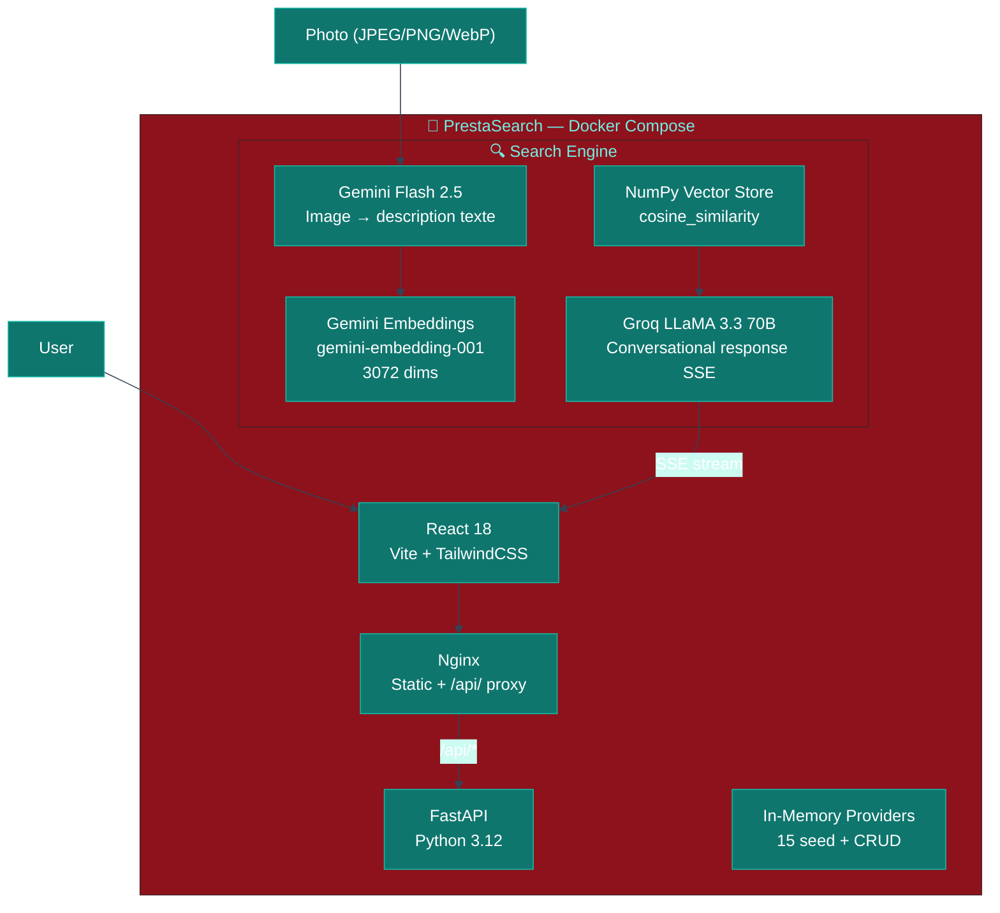
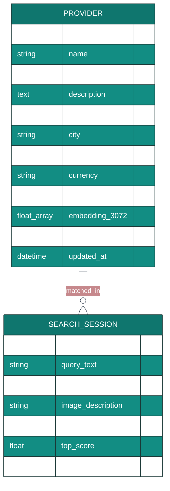

# PrestaSearch — Recherche sémantique de prestataires de services

> Décrivez votre besoin ou envoyez une photo. Trouvez le bon prestataire en 3 secondes.

[](https://fastapi.tiangolo.com)
[](https://reactjs.org)
[](https://ai.google.dev)
[](https://groq.com)

---

## Vue d'ensemble

PrestaSearch est un moteur de recherche multimodal pour trouver le prestataire de services idéal. L'utilisateur décrit son problème en langage naturel ou envoie une photo de sa situation, et le moteur identifie les prestataires les plus pertinents via Gemini Embeddings (3072 dimensions) avec Groq LLaMA 3.3 70B pour la réponse conversationnelle. Gemini Flash 2.5 analyse les images pour les convertir en description avant l'embedding.

**Live :** [prestasearch.wikolabs.com](https://prestasearch.wikolabs.com)  
**Domaine :** Service Marketplace / Conversational Search / Lead Generation

---

## Stack technique

| Couche | Technologie | Rôle |
|--------|------------|------|
| Frontend | React 18, TypeScript, TailwindCSS, Vite | Interface recherche + admin prestataires |
| Backend | FastAPI (Python 3.12), Uvicorn | API search, chat SSE, CRUD prestataires |
| Vision | Google Gemini Flash `gemini-2.5-flash` | Description image → texte pour embedding |
| Embeddings | Google Gemini `gemini-embedding-001` (3072-dim) | Vectorisation prestataires et requêtes |
| LLM | Groq LLaMA 3.3 70B (streaming SSE) | Réponses conversationnelles contextualisées |
| Vector Store | NumPy (in-memory cosine similarity) | Recherche haute performance sans DB |
| Infra | Docker Compose, Nginx | Conteneurisation, reverse proxy /api/ |

### backend/requirements.txt
```
fastapi==0.111.0
uvicorn[standard]==0.29.0
google-generativeai==0.7.2
groq==0.9.0
numpy==1.26.4
pydantic==2.7.1
python-multipart==0.0.9
pillow==10.3.0
pytest==8.2.0
```

---

## Architecture mono-repo

```
prestasearch/
├── frontend/
│   ├── src/
│   │   ├── App.tsx               # Routing : Search ↔ Admin tabs
│   │   ├── components/
│   │   │   ├── SearchBar.tsx     # Input texte + upload image (drag&drop, Ctrl+V)
│   │   │   ├── ProviderCard.tsx  # Carte prestataire (photo, spécialité, tarif)
│   │   │   ├── ChatMessage.tsx   # Réponse LLM avec ProviderCards
│   │   │   └── AdminPanel.tsx    # CRUD prestataires avec édition inline
│   │   └── api/
│   │       └── client.ts         # Fetch REST + SSE streaming
│   └── vite.config.ts
├── backend/
│   ├── main.py                   # FastAPI app + routes
│   ├── models.py                 # Pydantic schemas
│   ├── embeddings.py             # Gemini embed + cosine search
│   ├── vision.py                 # Gemini Flash image → description
│   ├── chat.py                   # Groq streaming chat
│   ├── providers.py              # In-memory provider store + CRUD
│   ├── seed_providers.py         # 15 prestataires initiaux
│   ├── tests/
│   │   └── test_api.py
│   ├── requirements.txt
│   └── Dockerfile
├── nginx.conf
├── docker-compose.yml
└── .github/workflows/deploy.yml
```

---

## Diagrammes UML

### Architecture système



### Séquence — Recherche par photo et texte

```mermaid
%%{init: {'theme': 'base', 'themeVariables': {'primaryColor': '#0f766e', 'primaryTextColor': '#fff', 'lineColor': '#374151'}}}%%
sequenceDiagram
    participant USER as User
    participant REACT as React 18
    participant API as FastAPI
    participant FLASH as Gemini Flash
    participant GEMINI as Gemini Embeddings
    participant NUMPY as Vector Store
    participant GROQ as Groq LLaMA

    USER->>REACT: Photo (robinet_qui_fuit.jpg) + "j'ai une fuite sous mon évier"

    REACT->>API: POST /search {query: "...", image: "data:image/jpeg;base64,..."}

    API->>FLASH: generate_content(image, "Describe this image in English for a service provider search")
    Note over FLASH: Analyse visuelle de l'image
    FLASH-->>API: "Water leak under kitchen sink, visible pipe joint dripping"

    Note over API: Fusion description image + texte utilisateur
    API->>GEMINI: embed_content(text="j'ai une fuite... Water leak under kitchen sink...")
    GEMINI-->>API: combined_vector [3072 dims]

    API->>NUMPY: cosine_similarity(combined_vector, provider_matrix)
    NUMPY-->>API: top_5 [{id: "plombier-martin", score: 0.96, ...}, ...]

    API->>GROQ: chat_completion(system=context, providers=top_5, query="...")
    Note over GROQ: Streaming SSE
    GROQ-->>API: "Pour votre fuite sous l'évier, voici les plombiers..." (stream)
    API-->>REACT: SSE chunks

    REACT-->>USER: Chat + 5 ProviderCards avec spécialité, tarif, ville
```

### Modèle de données



---

## PRD

### Problème
Trouver un prestataire de services de confiance est difficile : les plateformes existantes nécessitent de connaître la catégorie exacte ("plomberie", "électricité"), et ne comprennent pas les descriptions naturelles de problèmes. Un utilisateur qui dit "mon radiateur fait du bruit" ne sait pas s'il cherche un plombier ou un chauffagiste.

### Solution
PrestaSearch comprend les descriptions naturelles de problèmes et l'analyse visuelle via Gemini Flash pour déduire le type de prestataire nécessaire, retrouver les profils correspondants, et expliquer conversationnellement pourquoi chaque prestataire est pertinent pour le besoin exprimé.

### Utilisateurs cibles
| Persona | Besoin |
|---------|--------|
| Particulier | Trouver rapidement le bon prestataire pour un problème à domicile |
| Gestionnaire immobilier | Identifier le bon artisan pour un problème sur un bien |
| Marketplace opérateur | Moteur de matching sémantique pour une plateforme de services |

### OKRs
- Matching pertinence (bonne spécialité détectée) : ≥ 90%
- Latence image → résultats : < 3 secondes
- Taux d'engagement sur les résultats : > 60%

---

## User Stories

```
US-01 [Particulier] En tant que particulier,
      je veux décrire mon problème en langage naturel
      ("mon radiateur claque depuis ce matin")
      et voir les prestataires adaptés avec leur spécialité et tarif
      afin de contacter le bon professionnel immédiatement.

US-02 [Particulier] En tant que particulier,
      je veux prendre une photo du problème chez moi
      et envoyer directement la photo pour que l'IA comprenne
      afin de ne pas avoir à décrire techniquement ce que je vois.

US-03 [Admin] En tant qu'administrateur plateforme,
      je veux ajouter, modifier et supprimer des prestataires
      via l'onglet Admin avec formulaire complet
      et que les changements soient immédiatement reflétés dans la recherche
      afin de maintenir l'annuaire à jour en temps réel.

US-04 [Particulier] En tant que particulier,
      je veux combiner une photo et une description textuelle
      ("c'est ça mais dans la salle de bain")
      afin d'obtenir les résultats les plus précis possibles.

US-05 [Développeur] En tant que développeur,
      je veux accéder à l'API documentée via Swagger
      et intégrer le moteur de recherche dans une autre application
      afin de réutiliser le moteur de matching dans mon projet.
```

---

## Règles métier

| # | Règle | Description | Simulable UI |
|---|-------|-------------|-------------|
| R1 | Vision to text | Image → description anglaise via Gemini Flash avant embedding | ✅ Image analysis |
| R2 | Fusion requête | Description image + texte utilisateur concaténés pour l'embedding | ✅ Fusion query |
| R3 | Top-5 matching | 5 prestataires triés par score cosinus décroissant | ✅ Provider cards |
| R4 | Score seuil | Prestataires avec score < 0.5 exclus des résultats | ✅ Relevance score |
| R5 | Streaming SSE | Réponse LLM streamed token par token | ✅ Live streaming |
| R6 | CRUD prestataires | Create, Read, Update (keep_image flag), Delete | ✅ Admin panel |
| R7 | Édition inline | Édition prestataire avec conservation optionnelle de la photo | ✅ Edit form |
| R8 | Formats image | JPEG, PNG, WebP, HEIC — max 5 MB | ✅ Upload form |
| R9 | Seed providers | 15 prestataires pré-chargés au démarrage | ✅ Browse |
| R10 | Mise à jour live | Modification prestataire → embedding recalculé immédiatement | ✅ Real-time update |

---

## Spécification API

### POST /search
```json
{"query": "fuite sous l'évier", "image": "data:image/jpeg;base64,..."}
// Response (SSE): stream tokens → réponse avec 5 prestataires contextualisés
```

### POST /chat
```json
{"message": "j'ai besoin d'un électricien pour une mise aux normes"}
// Response (SSE): stream LLaMA 3.3 avec liste prestataires
```

### POST /prestataires
```
Content-Type: multipart/form-data
Fields: name, specialty, description, services (JSON array), city, hourly_rate, currency, image (optional)
// Response: {"id": "prest_xyz", "embedding_dims": 3072}
```

### PUT /prestataires/{id}
```
Content-Type: multipart/form-data
Fields: same as POST + keep_image: bool
// Response: {"updated": true, "id": "prest_xyz"}
```

---

## Simulation UI

| Composant | Description |
|-----------|-------------|
| **Search Bar** | Input texte + zone upload image (drag & drop, Ctrl+V, bouton) |
| **Provider Card** | Photo, nom, spécialité, services, ville, tarif horaire, score |
| **Chat Stream** | Réponse LLM contextuelle avec ProviderCards intégrées |
| **Admin Panel** | Formulaire ajout + liste éditables avec icône crayon par prestataire |

---

## Déploiement

```yaml
version: "3.9"
services:
  backend:
    build: ./backend
    environment:
      GOOGLE_API_KEY: "${GOOGLE_API_KEY}"
      GROQ_API_KEY: "${GROQ_API_KEY}"
    expose: ["8000"]
  frontend:
    build: ./frontend
    expose: ["80"]
  nginx:
    image: nginx:alpine
    ports: ["80:80"]
    volumes: [./nginx.conf:/etc/nginx/conf.d/default.conf]
```

---

## Installation locale

```bash
# 1. Configuration
cp .env.example .env
# Renseigner GOOGLE_API_KEY et GROQ_API_KEY

cp .env backend/.env

# 2. Backend
pip install -r requirements.txt
cd backend && python -m uvicorn main:app --port 8000

# 3. Frontend
cd frontend && npm install && npm run dev
# → http://localhost:5173 (proxy /api/ → localhost:8000)

# 4. Tests
cd backend && python -m pytest tests/ -v
```

---

## Roadmap

### Phase 1 — MVP ✅
- [x] Recherche sémantique texte (Gemini embeddings)
- [x] Chat conversationnel streaming (Groq LLaMA)
- [x] Admin CRUD prestataires

### Phase 2 — Vision ✅
- [x] Analyse image Gemini Flash (image → description)
- [x] Recherche multimodale (texte + photo)

### Phase 3 — Production
- [ ] Persistance PostgreSQL + pgvector
- [ ] Géolocalisation (filtrer par rayon km)
- [ ] Notation et avis prestataires
- [ ] Intégration calendrier disponibilités

---

*Un produit [Wikolabs](https://wikolabs.com) — Intelligence artificielle appliquée aux métiers*
